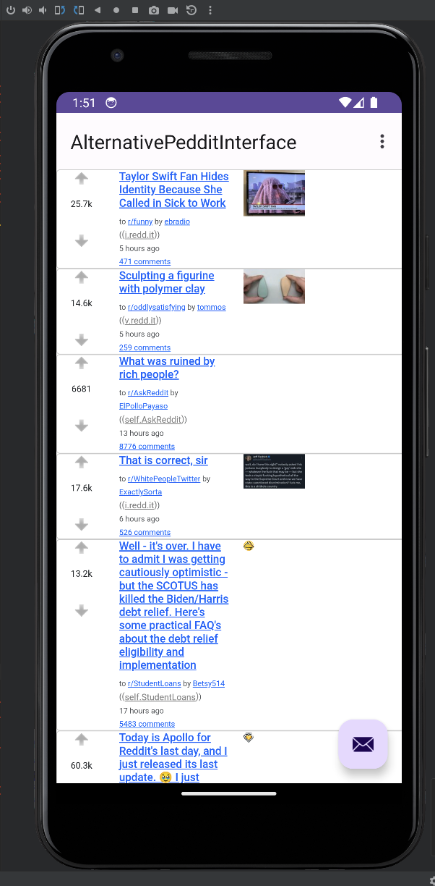

# AlternativePedditInterfae (API for Short)

# This Project Is Complete! It's Just a Proof of Concept

Reddit removed their API for apps so I was curious, could you easily make a Reddit app without using the API? The answer is yes. This is not really a functional app as all it does is display the homepage using a really sloppy design that was thrown together as just enough to prove a point. In addition, prior to this project I had never made an Android app let alone used Kotlin in any project. Also the whole app was completed in just a couple of hours. It's not good code, it was just me fulfilling a passing curiosity.

# I Want A Reddit App Though

You know what's funny? I've never even used a Reddit app before because I have something better than a Reddit app. My other project filters Reddit into a customizable RSS feed that allows you to perfectly filter only what you want to read. It allows you to read all the things you actually care about, but spend a fraction of the time scrolling through Reddit. Unfortunately, this project is not yet public, but once I finish up some other projects I plan to make it public.
